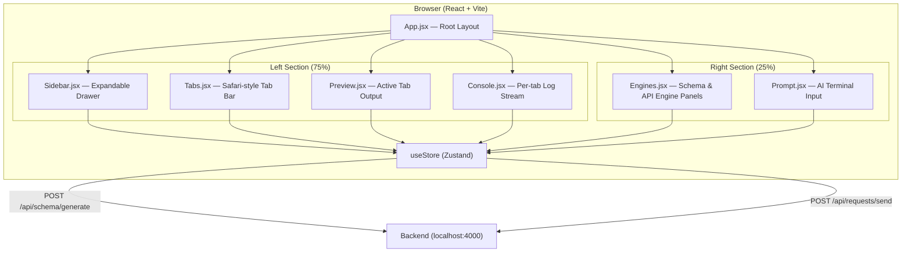
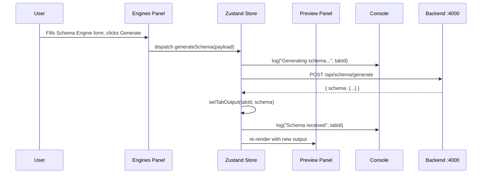
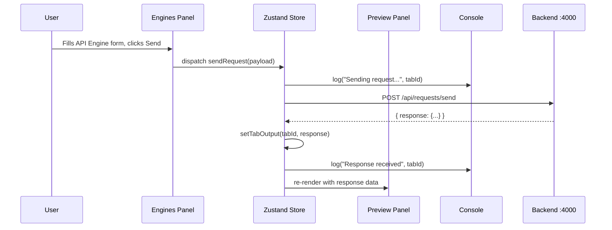
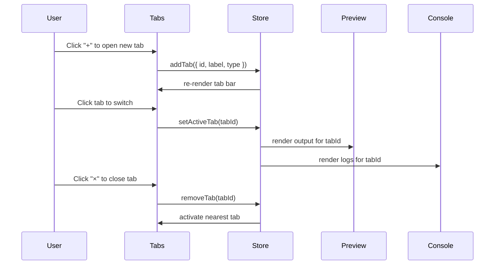

# Design Document: BRMH IDE Dashboard

## Overview

A fully rebuilt React frontend dashboard for the BRMH system — a browser-based IDE-style interface that replaces the existing single-page schema studio. The dashboard provides a split-pane workspace with a collapsible sidebar, Safari-style tab system, live preview panel, console log area, a right-side control panel housing the Schema and API engines, and an AI-style prompt terminal. All communication flows to the existing backend at `localhost:4000` via the two existing POST endpoints.

The design is a clean rebuild — no existing UI code is reused. The layout is fixed full-screen (100vh, no body scroll), horizontally split 75% left workspace and 25% right control panel.

---

## Architecture



---

## Sequence Diagrams

### Schema Generation Flow



### API Request Flow



### Tab Lifecycle



---

## Components and Interfaces

### App.jsx

**Purpose**: Root layout shell. Establishes the 75/25 horizontal split and mounts all child components.

**Interface**:
```typescript
// No props — top-level component
function App(): JSX.Element
```

**Responsibilities**:
- Render full-screen fixed layout (100vh, overflow hidden)
- Mount Left section (Sidebar + Tabs + Preview + Console)
- Mount Right section (Engines + Prompt)
- Apply Tailwind layout classes for the split

---

### Sidebar.jsx

**Purpose**: Collapsible icon drawer on the left edge of the workspace. Collapsed = icon strip; Expanded = floating overlay panel (does not push content).

**Interface**:
```typescript
interface SidebarItem {
  id: string        // e.g. "namespace"
  label: string     // e.g. "BRMH Namespace"
  icon: LucideIcon
}

function Sidebar(): JSX.Element
```

**Responsibilities**:
- Toggle between collapsed (icon-only) and expanded (floating panel) states
- Render four nav items: Namespace, Playstore, AWS Services, Settings
- Expanded panel floats over content (position: absolute, z-index elevated)
- Communicate active nav item to store

---

### Tabs.jsx

**Purpose**: Safari-style horizontal tab bar. Each tab represents an open service (Schema, API, etc.).

**Interface**:
```typescript
interface Tab {
  id: string
  label: string
  type: "schema" | "api" | "blank"
  output: unknown | null
}

function Tabs(): JSX.Element
```

**Responsibilities**:
- Render open tabs with active highlight
- "+" button to open a new blank tab
- "×" button per tab to close it
- Click to switch active tab (updates store)
- Overflow scroll when many tabs are open

---

### Preview.jsx

**Purpose**: Main content area. Renders the output of the currently active tab.

**Interface**:
```typescript
interface PreviewProps {
  // reads activeTab and its output from store
}

function Preview(): JSX.Element
```

**Responsibilities**:
- Read `activeTabId` and `tabs[activeTabId].output` from store
- If output is a schema object → render as formatted JSON (or visual tree)
- If output is an API response → render as formatted JSON
- If no output → render empty/placeholder state
- Fills remaining vertical space between tab bar and console

---

### Console.jsx

**Purpose**: Scrollable log panel anchored to the bottom of the left section. Shows logs scoped to the active tab.

**Interface**:
```typescript
interface LogEntry {
  id: string
  tabId: string
  timestamp: string   // ISO string
  level: "info" | "warn" | "error"
  message: string
}

function Console(): JSX.Element
```

**Responsibilities**:
- Read logs filtered by `activeTabId` from store
- Auto-scroll to bottom on new log entry
- Fixed height (e.g. 180px), does not affect layout above
- Styled as dark terminal (monospace font, dark bg)

---

### Engines.jsx

**Purpose**: Top portion of the right panel. Houses Schema Engine and API Engine as expandable inline panels (not popups).

**Interface**:
```typescript
type EngineType = "schema" | "api"

interface SchemaEnginePayload {
  prompt: string
  domain?: string
}

interface ApiEnginePayload {
  method: string
  url: string
  headers?: Record<string, string>
  body?: string
}

function Engines(): JSX.Element
```

**Responsibilities**:
- Render two engine toggle buttons: "Schema Engine" and "API Engine"
- Clicking a button expands its form inline within the right panel
- Schema Engine form: prompt textarea + optional domain field + Generate button
- API Engine form: method selector, URL input, headers, body textarea, Send button
- On submit: dispatch to store → triggers API call → result stored in active tab output
- Only one engine expanded at a time (accordion behavior)

---

### Prompt.jsx

**Purpose**: AI-style terminal input at the bottom of the right panel. Accepts free-text automation commands.

**Interface**:
```typescript
interface PromptCommand {
  id: string
  input: string
  timestamp: string
  response: string | null
}

function Prompt(): JSX.Element
```

**Responsibilities**:
- Render a styled terminal-like input area (dark bg, monospace, blinking cursor)
- Display command history above the input line
- On Enter: dispatch command to store, append to history, show dummy response initially
- Scrollable history area

---

## Data Models

### Global Store Shape (Zustand)

```typescript
interface Tab {
  id: string
  label: string
  type: "schema" | "api" | "blank"
  output: unknown | null
}

interface LogEntry {
  id: string
  tabId: string
  timestamp: string
  level: "info" | "warn" | "error"
  message: string
}

interface PromptCommand {
  id: string
  input: string
  timestamp: string
  response: string | null
}

interface AppState {
  // Sidebar
  sidebarExpanded: boolean
  activeSidebarItem: string | null

  // Tabs
  tabs: Tab[]
  activeTabId: string | null

  // Console
  logs: LogEntry[]

  // Engines
  activeEngine: "schema" | "api" | null
  engineLoading: boolean

  // Prompt
  promptHistory: PromptCommand[]

  // Actions
  toggleSidebar(): void
  setActiveSidebarItem(id: string): void

  addTab(tab: Omit<Tab, "output">): void
  removeTab(id: string): void
  setActiveTab(id: string): void
  setTabOutput(tabId: string, output: unknown): void

  addLog(entry: Omit<LogEntry, "id" | "timestamp">): void

  setActiveEngine(engine: "schema" | "api" | null): void
  generateSchema(payload: SchemaEnginePayload): Promise<void>
  sendRequest(payload: ApiEnginePayload): Promise<void>

  submitPromptCommand(input: string): void
}
```

**Validation Rules**:
- `tabs` must always have at least one entry after initialization
- `activeTabId` must always reference a valid tab id (or null only when tabs is empty)
- `logs` entries are append-only; never mutated after creation
- `promptHistory` entries are append-only

---

## Algorithmic Pseudocode

### Tab Management

```pascal
PROCEDURE addTab(label, type)
  INPUT: label: String, type: "schema" | "api" | "blank"
  OUTPUT: void (mutates store)

  SEQUENCE
    id ← generateUUID()
    newTab ← { id, label, type, output: null }
    tabs ← tabs.append(newTab)
    activeTabId ← id
  END SEQUENCE
END PROCEDURE

PROCEDURE removeTab(id)
  INPUT: id: String
  OUTPUT: void (mutates store)

  SEQUENCE
    index ← tabs.findIndex(t => t.id = id)
    tabs ← tabs.filter(t => t.id ≠ id)

    IF tabs.length = 0 THEN
      activeTabId ← null
    ELSE IF activeTabId = id THEN
      newIndex ← MAX(0, index - 1)
      activeTabId ← tabs[newIndex].id
    END IF
  END SEQUENCE
END PROCEDURE
```

**Preconditions**:
- `removeTab`: id must exist in tabs array
- `addTab`: label must be non-empty string

**Postconditions**:
- `addTab`: new tab is active, tabs.length increases by 1
- `removeTab`: tabs.length decreases by 1, activeTabId points to valid tab or null

---

### Schema Generation

```pascal
PROCEDURE generateSchema(payload)
  INPUT: payload: { prompt: String, domain?: String }
  OUTPUT: void (async, mutates store)

  PRECONDITION: payload.prompt ≠ ""
  PRECONDITION: activeTabId ≠ null

  SEQUENCE
    engineLoading ← true
    addLog({ tabId: activeTabId, level: "info", message: "Generating schema..." })

    TRY
      response ← await POST("/api/schema/generate", payload)
      setTabOutput(activeTabId, response.schema)
      addLog({ tabId: activeTabId, level: "info", message: "Schema generated successfully" })
    CATCH error
      addLog({ tabId: activeTabId, level: "error", message: error.message })
    FINALLY
      engineLoading ← false
    END TRY
  END SEQUENCE
END PROCEDURE
```

**Loop Invariants**: N/A (no loops)

**Postconditions**:
- `engineLoading` is always reset to false regardless of success/failure
- A log entry is always appended for both success and error paths

---

### API Request Send

```pascal
PROCEDURE sendRequest(payload)
  INPUT: payload: { method: String, url: String, headers?: Object, body?: String }
  OUTPUT: void (async, mutates store)

  PRECONDITION: payload.url ≠ ""
  PRECONDITION: payload.method ∈ { "GET", "POST", "PUT", "DELETE", "PATCH" }

  SEQUENCE
    engineLoading ← true
    addLog({ tabId: activeTabId, level: "info", message: "Sending " + payload.method + " " + payload.url })

    TRY
      response ← await POST("/api/requests/send", payload)
      setTabOutput(activeTabId, response)
      addLog({ tabId: activeTabId, level: "info", message: "Response: " + response.status })
    CATCH error
      addLog({ tabId: activeTabId, level: "error", message: error.message })
    FINALLY
      engineLoading ← false
    END TRY
  END SEQUENCE
END PROCEDURE
```

---

### Sidebar Toggle

```pascal
PROCEDURE toggleSidebar()
  SEQUENCE
    sidebarExpanded ← NOT sidebarExpanded
  END SEQUENCE
END PROCEDURE
```

**Postcondition**: `sidebarExpanded` is the boolean complement of its prior value

---

### Prompt Command Dispatch

```pascal
PROCEDURE submitPromptCommand(input)
  INPUT: input: String
  OUTPUT: void (mutates store)

  PRECONDITION: input.trim() ≠ ""

  SEQUENCE
    command ← { id: generateUUID(), input: input.trim(), timestamp: now(), response: null }
    promptHistory ← promptHistory.append(command)
    addLog({ tabId: activeTabId, level: "info", message: "[Prompt] " + input })

    // Dummy response for now
    response ← "Command received: " + input
    command.response ← response
  END SEQUENCE
END PROCEDURE
```

---

## Key Functions with Formal Specifications

### `useStore` (Zustand store factory)

```typescript
const useStore = create<AppState>((set, get) => ({ ... }))
```

**Preconditions**: Called once at module level; not called inside components
**Postconditions**: Returns a stable hook usable in any component

---

### `generateSchema(payload)`

```typescript
async function generateSchema(payload: SchemaEnginePayload): Promise<void>
```

**Preconditions**:
- `payload.prompt` is a non-empty string
- `activeTabId` is not null

**Postconditions**:
- On success: `tabs[activeTabId].output` contains the schema object
- On failure: a log entry with `level: "error"` is appended
- `engineLoading` is `false` after resolution

---

### `sendRequest(payload)`

```typescript
async function sendRequest(payload: ApiEnginePayload): Promise<void>
```

**Preconditions**:
- `payload.url` is a non-empty string
- `payload.method` is one of the valid HTTP methods

**Postconditions**:
- On success: `tabs[activeTabId].output` contains the response object
- On failure: error log appended
- `engineLoading` is `false` after resolution

---

### `addLog(entry)`

```typescript
function addLog(entry: Omit<LogEntry, "id" | "timestamp">): void
```

**Preconditions**: `entry.tabId` references an existing tab id
**Postconditions**: `logs.length` increases by 1; new entry has auto-generated `id` and `timestamp`

---

## Example Usage

```typescript
// App.jsx — root layout
function App() {
  return (
    <div className="flex h-screen overflow-hidden bg-gray-950 text-white">
      <div className="relative flex flex-col w-3/4 border-r border-gray-800">
        <Sidebar />
        <Tabs />
        <Preview />
        <Console />
      </div>
      <div className="flex flex-col w-1/4">
        <Engines />
        <Prompt />
      </div>
    </div>
  )
}

// Engines.jsx — triggering schema generation
function Engines() {
  const { generateSchema, activeTabId, engineLoading } = useStore()
  const [prompt, setPrompt] = useState("")

  const handleGenerate = () => {
    if (!prompt.trim()) return
    generateSchema({ prompt })
  }

  return (
    <div>
      <textarea value={prompt} onChange={e => setPrompt(e.target.value)} />
      <button onClick={handleGenerate} disabled={engineLoading}>
        {engineLoading ? "Generating..." : "Generate"}
      </button>
    </div>
  )
}

// Console.jsx — filtered log rendering
function Console() {
  const { logs, activeTabId } = useStore()
  const activeLogs = logs.filter(l => l.tabId === activeTabId)

  return (
    <div className="h-44 overflow-y-auto font-mono text-xs bg-gray-900">
      {activeLogs.map(log => (
        <div key={log.id} className={levelClass(log.level)}>
          [{log.timestamp}] {log.message}
        </div>
      ))}
    </div>
  )
}
```

---

## Correctness Properties

*A property is a characteristic or behavior that should hold true across all valid executions of a system — essentially, a formal statement about what the system should do. Properties serve as the bridge between human-readable specifications and machine-verifiable correctness guarantees.*

### Property 1: Active tab validity invariant

*For any* sequence of `addTab` and `removeTab` operations, `activeTabId` always references a tab that exists in the `tabs` array, or is `null` only when `tabs` is empty.

**Validates: Requirements 9.1, 3.3**

### Property 2: Log referential integrity

*For any* `addLog` call, the resulting `LogEntry.tabId` references a tab that existed in the `tabs` array at the time the log was created.

**Validates: Requirements 9.2**

### Property 3: engineLoading always resets

*For any* call to `generateSchema` or `sendRequest`, `engineLoading` is `false` after the returned promise settles, regardless of whether the request succeeded or failed.

**Validates: Requirements 6.8, 7.7**

### Property 4: removeTab activates adjacent tab

*For any* `removeTab` call where the removed tab was the active tab and at least one other tab exists, `activeTabId` is updated to the nearest adjacent tab in the array.

**Validates: Requirements 3.3, 9.1**

### Property 5: addTab makes new tab active

*For any* `addTab` call, the newly created tab immediately becomes the active tab and `tabs.length` increases by exactly 1.

**Validates: Requirements 3.2, 9.5**

### Property 6: Prompt command appended before async work

*For any* non-empty, non-whitespace-only prompt input, the `PromptCommand` entry is appended to `promptHistory` synchronously before any async operations begin.

**Validates: Requirements 8.3**

### Property 7: Sidebar toggle is a pure boolean complement

*For any* sidebar state, calling `toggleSidebar` produces a state where `sidebarExpanded` is the boolean complement of its prior value, with no side effects on layout dimensions.

**Validates: Requirements 2.2**

### Property 8: Console filters logs by active tab

*For any* `logs` array containing entries with mixed `tabId` values, the Console renders only those entries whose `tabId` equals the current `activeTabId`.

**Validates: Requirements 5.1**

### Property 9: Schema generation output round-trip

*For any* successful `generateSchema` call, the value stored in `tabs[activeTabId].output` is exactly the schema object returned by the backend response.

**Validates: Requirements 6.5**

### Property 10: Whitespace prompt is a no-op

*For any* string composed entirely of whitespace characters, submitting it via `submitPromptCommand` leaves `promptHistory.length` unchanged.

**Validates: Requirements 8.5**

### Property 11: Accordion engine exclusivity

*For any* state where one engine panel is expanded, expanding the other engine panel results in the first being collapsed, so that at most one engine panel is expanded at any time.

**Validates: Requirements 6.2, 7.2**

---

## Error Handling

### Network Failure (Schema or API Engine)

**Condition**: `fetch` rejects or backend returns non-2xx
**Response**: Catch block appends an error-level log entry to the active tab's console
**Recovery**: `engineLoading` reset to false; user can retry; tab output unchanged

### Empty Active Tab

**Condition**: User triggers engine action with no active tab
**Response**: Action is a no-op; optionally a warning log is appended
**Recovery**: User opens a tab first

### Tab Removal — Last Tab

**Condition**: User closes the only remaining tab
**Response**: `tabs` becomes empty, `activeTabId` set to null
**Recovery**: Preview and Console render empty/placeholder states; "+" button always available

### Invalid Prompt Input

**Condition**: User submits empty or whitespace-only prompt
**Response**: `submitPromptCommand` is a no-op (guarded by precondition check)
**Recovery**: Input field remains focused; no history entry created

---

## Testing Strategy

### Unit Testing Approach

Test each Zustand action in isolation using `@testing-library/react` and `vitest`:
- `addTab` / `removeTab` / `setActiveTab` — verify tab array and activeTabId invariants
- `addLog` — verify log array growth and field population
- `generateSchema` / `sendRequest` — mock `fetch`, verify store mutations and log entries

### Property-Based Testing Approach

**Property Test Library**: fast-check

Key properties to verify:
- For any sequence of `addTab` / `removeTab` operations, `activeTabId` is always valid or null
- For any number of `addLog` calls, logs array length equals the number of calls
- For any `removeTab` on a non-active tab, `activeTabId` is unchanged

### Integration Testing Approach

- Mount `<App />` in a test environment with mocked fetch
- Simulate user flow: open tab → trigger schema engine → verify preview renders output
- Simulate tab switching → verify console shows correct tab's logs

---

## Performance Considerations

- Console log array is append-only; for long sessions, consider slicing to last N entries (e.g. 500) per tab to avoid unbounded memory growth
- Preview JSON rendering uses `JSON.stringify` with indentation; for very large schemas, consider virtualized rendering or lazy expansion
- Sidebar floating panel uses CSS `position: absolute` — no layout reflow on toggle

---

## Security Considerations

- All API calls proxy through Vite dev server (`/api` → `localhost:4000`); no CORS issues in dev
- No user credentials are stored in the frontend store
- Prompt terminal input is treated as plain text; no eval or dynamic code execution

---

## Dependencies

| Package | Version | Purpose |
|---|---|---|
| react | ^18.3.1 | UI framework |
| react-dom | ^18.3.1 | DOM rendering |
| zustand | ^5.x | State management |
| lucide-react | ^0.511.0 | Icons for sidebar and engine buttons |
| framer-motion | ^12.9.4 | Sidebar expand/collapse animation |
| tailwindcss | via CDN or npm | Utility-first styling |
| @vitejs/plugin-react | ^5.0.0 | Vite React plugin |
| vite | ^7.0.0 | Dev server + build tool |

> Note: `zustand` needs to be added to `frontend/package.json` — it is not currently installed.
